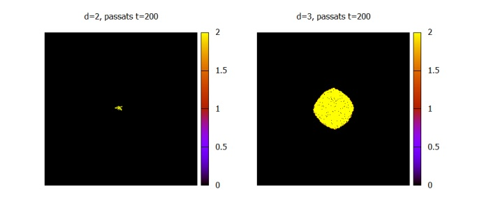
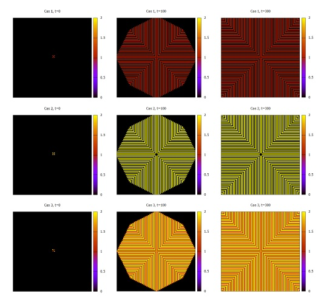
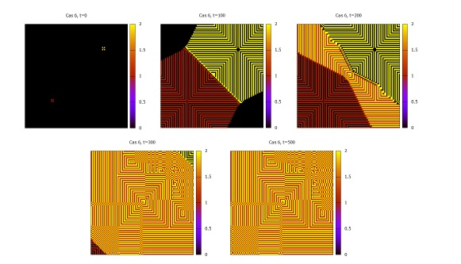

This Repo contains two projects but as the base code is more or less the same it's been decided to be in just one repo.
In the first project (Project 1), how certain states in the cells are propagated according to time and the probability of propagation and, in the second project (Project ), according to
time with fixed propagation rules.
This study can be used to work out solutions when there's a propagation of a disease (project 1) or when you want to study the formation in certain materials (project 2)

\
*Propagation of a disease (project 1)*

\
*Formation of different structures (project 2)*

\
*Formation of different structures (project 2)*
